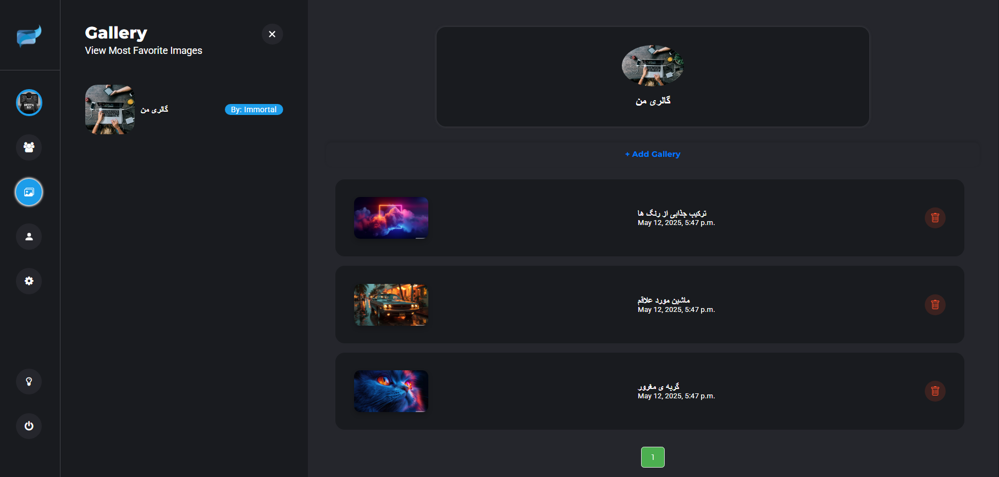
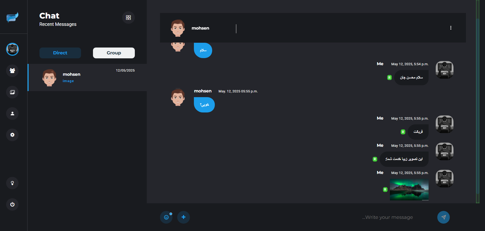
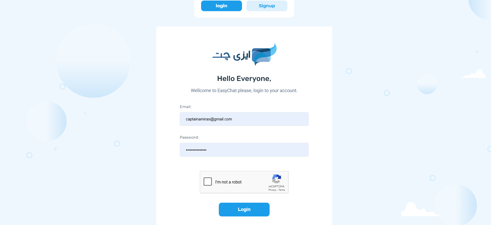
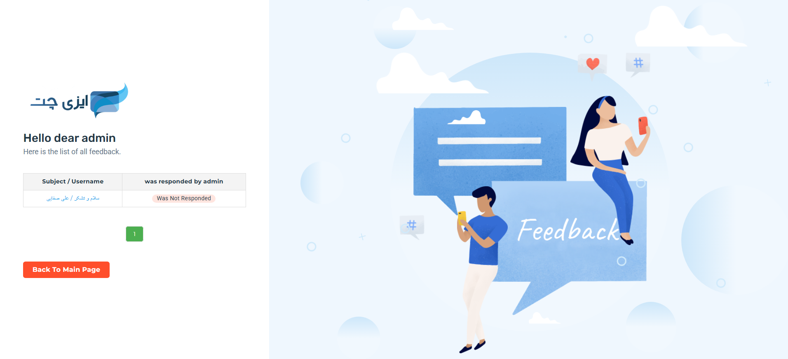

# 💬 EasyChatz – LiveChat Platform

EasyChatz is a private real-time chat platform built with Django and WebSockets. It enables fast and seamless one-to-one and group communication using Django Channels and async technology. Designed for customizability and performance, EasyChatz includes rich features like a private media gallery and an admin dashboard.

---

## 🚀 Features

- 🔐 User registration & login
- 💬 One-to-one direct messaging (private chat)
- 👥 Group chat with real-time updates
- 🖼️ Personal media gallery for users
- 🛠️ Custom-designed user dashboard
- 🔧 Admin panel for managing users and rooms
- ⚡ Built with Django Channels and async WebSocket communication
- 📦 Fully Dockerized and ready for deployment

---

## 🛠 Tech Stack

- **Backend:** Django, Django Channels
- **Realtime Communication:** WebSockets (AsyncIO)
- **Database:** PostgreSQL
- **Cache & WebSocket Layer:** Redis
- **Deployment:** Docker, Docker Compose, Nginx

---

## 📷 Screenshots

### 🏠 Homepage


### 🖼️ Gallery


### 💬 Live Chat


### 📝 Register Page


### 💡 User Feedback Section


---

## 📦 Deployment

This project is fully containerized for production with Docker.  
To run locally:

```bash
docker-compose up --build
